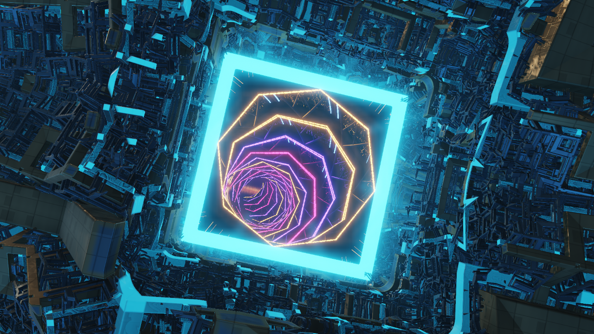

# AFTERLIGHT

**A signal from beyond.** A three-minute, real-time space demoscene: a planetary dawn, an ancient orbital machine, a passage through hyperspace, the edge of a black hole, and a new beginning. Original procedural visuals and a synchronized synthesized soundtrack live inside one native Windows executable.

[Download for Windows 11](https://github.com/icekeeper/afterlight/releases/latest) · [Watch the complete demo](https://github.com/icekeeper/afterlight/releases/download/v1.4.1/AFTERLIGHT-visual-preview.mp4)



The fourth visual iteration connects all five environments into one continuous flight. The orbital machine shares the planet's world; its central gallery opens onto the corridor. The corridor releases thousands of solid fragments, which spiral toward the black hole beyond its physical end. An expanding shock front then turns the accretion cloud into a stellar nursery. Shared camera positions, directions and lenses carry the handoffs; there are no scene crossfades or chapter cards.

The transforming recursive machine, planetary storms, granular rings, gravitationally bent plasma, and nursery's cached volumetric shadows and curl flow are entirely procedural. Geometry, materials, lighting fields and five-level HDR bloom are generated from code. There are no imported texture or mesh assets. The original three-minute score is unchanged.

The implementation draws on creator write-ups for **Agenda Circling Forth**, **Frameranger**, **Media Error**, **H–Immersion**, Mercury's **hg_sdf**, and recursive space folding. [Research notes](docs/RESEARCH.md) explain the sources, the techniques adopted, and the differences in this implementation. [Validation results](docs/VALIDATION.md) cover continuity, audio and measured performance.

AFTERLIGHT 1.4.1 is **164,352 bytes (160.5 KiB)**, down **90.3%** from the original 1.4.0 executable. Executable compression and a smaller native build preserve the full show and its rendering performance. [Size optimization notes](docs/SIZE_OPTIMIZATION.md) describe the changes and visual/audio comparisons.

## Play

Download **AFTERLIGHT.exe** or the Windows ZIP from [Releases](https://github.com/icekeeper/afterlight/releases/latest). Double-click the executable, then press **Enter**. Headphones recommended. Source builds place the executable in `dist`.

Runs on Windows 11 x64 using the graphics and audio components included with Windows. No installer, browser, internet connection, redistributable package, or external assets are required. A Direct3D 11-capable graphics device is recommended. The demo builds its soundtrack when it starts; allow a moment for preparation.

| Key | Action |
| --- | --- |
| Enter / Space | Start or pause |
| F11 / Alt+Enter | Toggle fullscreen |
| R | Replay from the beginning |
| Left / Right | Seek backward / forward ten seconds |
| M | Mute / unmute |
| H | Show / hide the HUD |
| 1 / 2 / 3 | Render at 540p / 720p / 1080p |
| Esc | Quit |

If playback is slow, press **1** to lower the rendering resolution. Fullscreen keeps the display's native resolution while scaling the image.

## Build from source

The build uses portable **Zig 0.13.0** and **UPX 5.2.1**. Visual Studio and the Windows SDK do not need to be installed. From PowerShell in the source directory:

```powershell
powershell -ExecutionPolicy Bypass -File .\build.ps1 -DownloadToolchain
```

The first build downloads Zig from its [official download site](https://ziglang.org/download/) and UPX from its [official release](https://github.com/upx/upx/releases/tag/v5.2.1), verifies both archives against pinned SHA-256 hashes, and extracts them into `tools`. Later builds reuse them. All compiler caches stay inside `build`; nothing is installed system-wide. If Zig is already available elsewhere:

```powershell
.\build.ps1 -ZigPath C:\path\to\zig.exe
```

The result is `dist/AFTERLIGHT.exe`. Copy that executable by itself to another Windows 11 PC to play it. The C++ runtime is linked statically; compiled scene shaders, icon, and music synthesis are embedded. Startup also generates the nebula's light and flow cache on the GPU. The build checks that the executable imports only Windows components and uses the Windows GUI subsystem.

## Capture and diagnostics

```powershell
# Render a frame at 120 seconds to a BMP file.
.\dist\AFTERLIGHT.exe --capture 120 .\frame.bmp

# Render the title screen to a BMP file.
.\dist\AFTERLIGHT.exe --capture-menu .\title.bmp

# Export the complete original score as a WAV file.
.\dist\AFTERLIGHT.exe --export-wav .\afterlight.wav

# Run the built-in renderer and soundtrack checks.
.\dist\AFTERLIGHT.exe --self-test

# Use the Windows software renderer (slow; useful for diagnostics).
.\dist\AFTERLIGHT.exe --warp

# Measure sustained frame rendering at a selected internal quality.
.\dist\AFTERLIGHT.exe --benchmark --quality 3

# Capture six seconds of animation as numbered BMPs for external encoding.
.\dist\AFTERLIGHT.exe --sequence 78 6 30 .\frames --quality 3
```

## Source map

- `main.cpp`: native window, renderer, playback, controls, typography, capture, and diagnostics.
- `scene.hlsl` / `scene_*.hlsl`: timeline, shared mathematics, and five procedural scene modules.
- `scene_journey.hlsl`: shared camera choreography, portal coordinates and world transforms.
- `scene_particles.hlsl`: procedural instanced fragments, shared camera projection and surface occlusion.
- `scene_volume_cache.hlsl`: startup generation of the nursery's optical-depth and flow atlas.
- `scene_resolve.hlsl`: depth reconstruction and screen-space contact shading for solid fragments.
- `postprocess.h`: HDR bloom pyramid, optical scatter, and final tone mapping.
- `shader-compile.cpp`: compiles the scene into embedded Direct3D bytecode during the build.
- `file-output.h`: compact, checked output for captures, audio exports and diagnostic reports.
- `soundtrack.cpp` / `soundtrack.h`: original score and synthesis.
- `build.ps1`: shader embedding, resource compilation, and static executable build.
- `verify-imports.ps1`: checks the native executable architecture, subsystem, and DLL imports.
- `resources.rc` / `assets`: embedded Windows metadata and icon.
- `docs`: preview, research, and recorded validation results.
- `tools`: optional preview encoding, frame analysis, and release packaging scripts.

Downloaded toolchains, compiler caches, captures and distribution files are excluded from Git. The repository contains the source needed to rebuild the demo; playable downloads live in GitHub Releases.

The default build compresses the executable with UPX and verifies its integrity.
Use `-Unpacked` to build without UPX, or `-UpXPath C:\path\to\upx.exe` to use an
existing copy. Both forms run without installing anything. The build always
keeps the ordinary executable at `build/AFTERLIGHT-unpacked.exe` and audits its
DLL imports before compression.

## Developer utilities

The executable does not need these utilities. Recording previews optionally uses FFmpeg; frame analysis uses Node.js. Both scripts are in `tools`:

```powershell
.\tools\encode-preview.ps1 -InputDirectory .\frames -OutputPath .\preview.mp4 -FFmpegPath C:\ffmpeg\bin\ffmpeg.exe
node .\tools\analyze-frames.cjs .\frames
.\tools\package-release.ps1

# Compare an earlier executable with the current build (renders and full PCM).
.\tools\verify-equivalence.ps1 -Baseline C:\path\to\previous\AFTERLIGHT.exe
```

For a complete 180-second, 60 fps capture, pass `--skip-first 180 --skip-last 360` to frame analysis to exclude the intentional opening and closing exposure ramps. Release packaging creates the Windows ZIP and SHA-256 checksums in `dist`.

The show is generated in real time from mathematics and code. No stock footage, downloaded music, or external texture files are used.

## License

AFTERLIGHT's original source, visuals, synthesized music and documentation are dedicated to the public domain under [CC0 1.0 Universal](LICENSE). Copy, modify, use commercially and redistribute them without an attribution or share-alike requirement. See the [CC0 summary](https://creativecommons.org/publicdomain/zero/1.0/).

The compiler and third-party runtime components retain their own licenses. Their notices are included in [Third-party notices](docs/THIRD_PARTY_NOTICES.md) and the release package.
